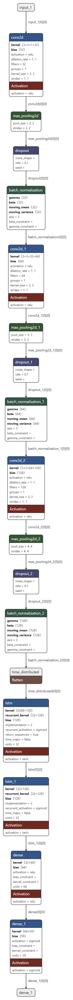
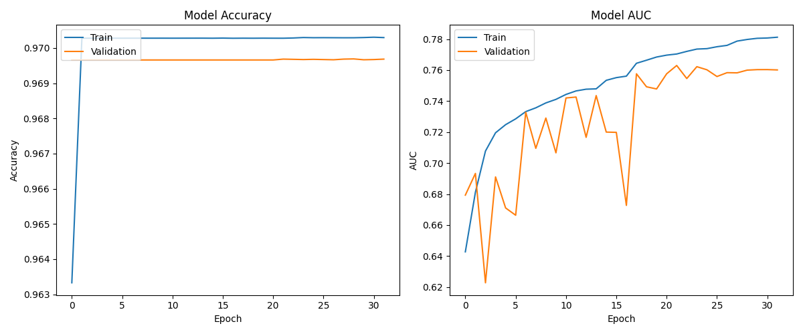

Music Tagging with CRNN using MTG Jamendo Dataset
Overview
This repository contains the implementation of a music tagging system using a Convolutional Recurrent Neural Network (CRNN). The project focuses on mood/theme recognition in music tracks, utilizing low-quality data from the MTG Jamendo dataset. Mel spectrograms of size 128x1024 are generated from audio data and fed into the CRNN model for effective tagging.

Dataset
The project uses the MTG Jamendo Dataset, which provides a rich collection of music tracks with mood/theme annotations. The dataset is designed for tasks like music tagging, recommendation, and analysis.

Features
CRNN Architecture: Combines CNN and RNN layers to effectively capture both spatial and temporal features in audio data.
Mel Spectrogram Generation: Converts audio tracks into 128x1024 Mel spectrograms for detailed feature representation.
Mood/Theme Recognition: Focuses on identifying various moods and themes in music tracks.
Low-Quality Data Utilization: Optimizes performance even with low-quality audio inputs.

Model Architecture
The CRNN model used in this project is structured as follows:

Convolutional layers for feature extraction from Mel spectrograms.
Recurrent layers for capturing temporal dependencies.
Dense layers for mood/theme classification.

Results
The model demonstrates effective mood/theme tagging on the MTG Jamendo dataset. For detailed performance metrics, see results.md.

